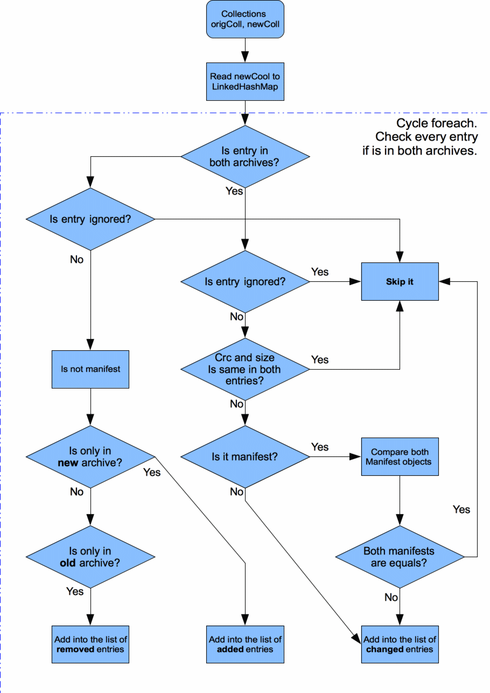

# Patchmaker tool 

This tool can be used to make installable updates to your product.

## Features 
* Can be used as standalone commandline tool
* Can be used as ant plugin with defined tasks
* Can be used as Maven plugin in automatic builds
* Fully automatic (build.xml, changelog, checksums, … etc)
* Can handle Manifest files (ignore irrelevant attributes)
* Comparing CRC of files in ZipInputStream instead of extracting all files and complete byte diffing it
* Maven plugin is configured by pom.xml

## How it works
* Input: Old and new released installer jar
* Read both archives into the two Java Collections
* Collections contains recursive tree of archives
* Then comparing collection entries
* Output from comparing method are 3 Lists: Changed, New and Removed files
* Create META-INF/info.xml
* Create build.xml (installation script)
* Unzip all new and changed files from new distribution archive into the temp
* Make update distribution archive
* Make checksums of distribution archive

## Process of reading archives

## Process of creating patches

